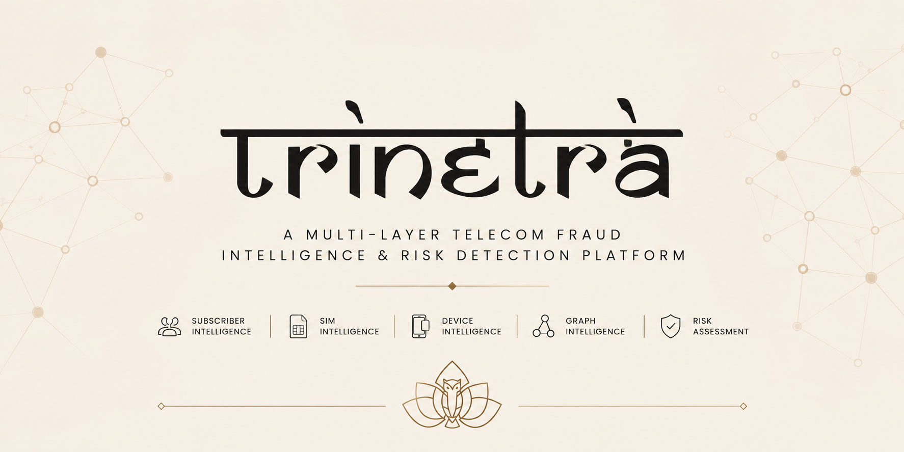

<div align="center">



# त्रिनेत्र · Trinetra

**A multi-layer telecom fraud intelligence and risk detection platform**

[](LICENSE)
[](backend)
[](data-generator)
[](data)
[]()

</div>

---

Trinetra is an independent research prototype for exploring multi-layer telecom fraud detection and explainable risk scoring. It correlates subscriber, SIM, device, and behavioral signals over synthetic telecom network traces, using a rule-based risk engine and graph correlation to surface anomalies and flag investigations automatically.

Built for the kind of fraud patterns real telecom networks see: SIM farming, device sharing rings, stolen IMEIs, dealer-level fraud clusters, and impossible-travel signaling anomalies.

## Table of Contents

- [Why Trinetra](#why-trinetra)
- [Architecture](#architecture)
- [Directory Structure](#directory-structure)
- [Quickstart](#quickstart)
- [API Reference](#api-reference)
- [Risk Engine](#risk-engine)
- [Roadmap](#roadmap)
- [License](#license)

## Why Trinetra

Telecom fraud detection systems are usually black boxes: a score comes out, and nobody downstream can explain why. Trinetra is built around the opposite premise, every risk score should be traceable to specific, auditable rules, and every flagged subscriber should generate an investigation record with a clear reason.

The platform is intentionally layered:

- **Subscriber Intelligence** — ownership patterns, SIM concentration, complaint history
- **SIM Intelligence** — activation history, churn, dealer/PoS association
- **Device Intelligence** — IMEI sharing, blacklist status, device-to-SIM ratios
- **Graph Intelligence** — cross-entity correlation across subscribers, SIMs, and devices
- **Risk Assessment** — weighted rule evaluation producing an auditable, explainable score

## Architecture

```
                     त्रिनेत्र
                        │
      ┌─────────────────┼─────────────────┐
      ↓                 ↓                 ↓
 Subscriber          Device            Behaviour
 Intelligence      Intelligence       Intelligence
      │                 │                 │
      └─────────────────┼─────────────────┘
                         ↓
                Fraud Intelligence
                         ↓
                    Risk Engine
                         ↓
              SQLite Database (trinetra.db)
```

A Python generator seeds a portable SQLite database with realistic benign and fraudulent subscriber traces. A Rust (Axum + SQLx) backend serves this data through a REST API and runs the rule-based risk engine on demand, auto-opening investigations for anything scoring HIGH or above.

## Directory Structure

| Path | Description |
|---|---|
| `data/` | Database migration scripts and the canonical portable database file `trinetra.db` |
| `data-generator/` | Python simulator generating benign traces and 8 distinct fraud scenarios |
| `backend/` | Rust Axum web API using SQLx for parameterized queries and the risk evaluation engine |
| `dataset/` | Public FraudZen bypass-fraud CDR trace data for external ML experiments |
| `private/` | Project requirements, agent instruction manuals, and design guidelines |

## Quickstart

### 1. Generate and populate the database

The generator runs migrations and seeds `data/trinetra.db` with 500+ subscribers across 8 fraud scenarios, plus locations, points of sale, SIMs, devices, and network events.

```bash
# from repository root
python data-generator/generator.py --clean
```

### 2. Build and run the backend

```bash
cd backend
cargo run
```

The API starts on `http://127.0.0.1:3000`.

## API Reference

### Subscribers & Risk Assessment

| Method | Endpoint | Description |
|---|---|---|
| `GET` | `/api/subscribers` | List subscribers (paginated, supports `?q=` search) |
| `GET` | `/api/subscribers/:id` | Full profile: active SIMs, device history, recent events, risk assessment history |
| `POST` | `/api/subscribers/:id/evaluate` | Run the rule engine on a subscriber; auto-generates an investigation if score is HIGH or VERY HIGH |

### Devices

| Method | Endpoint | Description |
|---|---|---|
| `GET` | `/api/devices` | List device entities |
| `GET` | `/api/devices/:id` | Device profile with every SIM ever loaded and recent events |

### Investigations & Audit

| Method | Endpoint | Description |
|---|---|---|
| `GET` | `/api/investigations` | List active fraud investigations |
| `PUT` | `/api/investigations/:id` | Update status (`PENDING` → `UNDER_REVIEW` → `RESOLVED`) and investigator notes |
| `GET` | `/api/audit_logs` | Fetch the system audit trail |

## Risk Engine

Every subscriber evaluation runs through six weighted rules:

| Rule | Trigger | Weight |
|---|---|---|
| SIM Concentration | Subscriber owns more than 9 SIM cards | +30 |
| Device Sharing | An IMEI is shared across more than 5 distinct SIMs | +25 |
| Stolen Device | SIM active on a blacklisted IMEI | +40 |
| Fraud Reports | External complaint count | +15 per report, capped at +40 |
| Suspicious PoS | Registration dealer has a fraud report rate above 30% | +15 |
| Geographic Anomaly | Consecutive signaling events in different states within 1 hour | +20 |

Scores map to categorical risk levels:

| Score | Level | Behavior |
|---|---|---|
| 0-24 | LOW | — |
| 25-49 | MEDIUM | — |
| 50-74 | HIGH | Auto-opens investigation |
| 75-100 | VERY HIGH | Auto-opens investigation |

## Roadmap

This is an active research prototype. Planned areas of work include expanding graph-based correlation beyond direct device sharing, refining the ML experiments against the FraudZen dataset, and hardening the API for concurrent evaluation workloads.

Contributions and issue reports are welcome while the project is under development.

## License

Released under the [MIT License](LICENSE).
